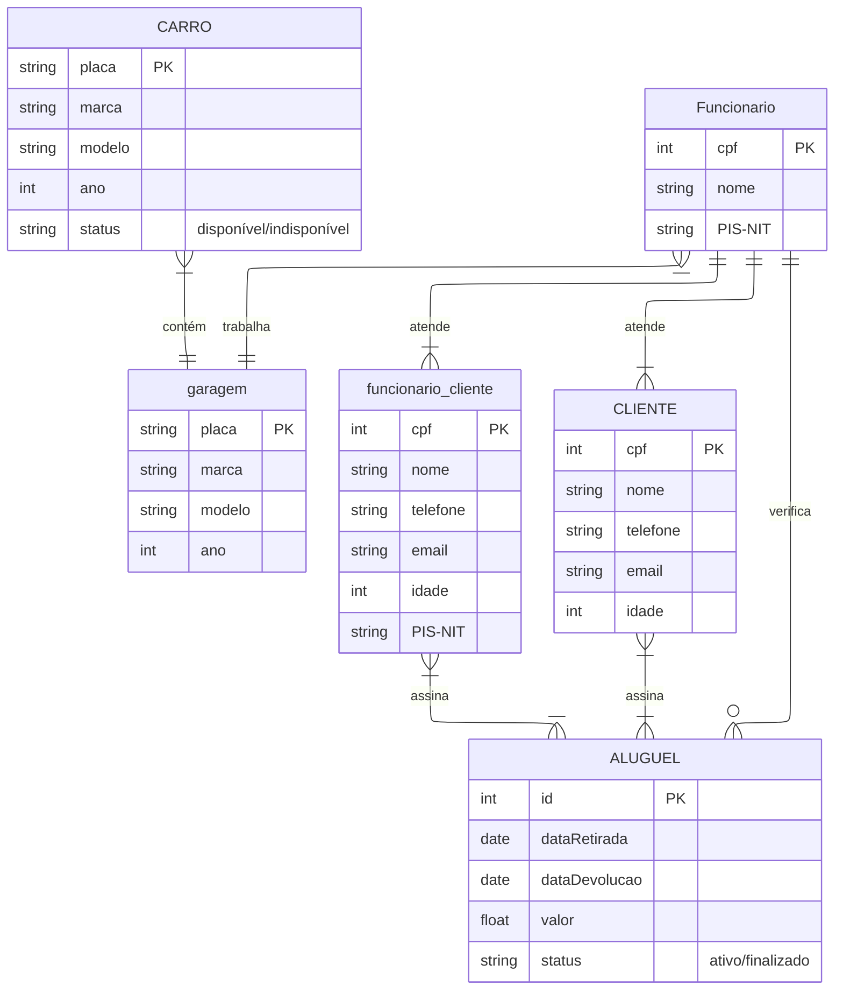

# ALUCAR-
Aplicativo para empresa de aluguel de carros para motoristas de aplicativos

```mermaid
---
config:
  layout: elk
---
erDiagram
	direction TB
	ALUGUEL {
		int id PK ""  
		date dataRetirada  ""  
		date dataDevolucao  ""  
		float valor  ""  
		string status  "ativo/finalizado"  
	}

	CARRO {
		string placa PK ""  
		string marca  ""  
		string modelo  ""  
		int ano  ""  
		string status  "disponível/indisponível"  
	}

	garagem {
		string placa PK ""  
		string marca  ""  
		string modelo  ""  
		int ano  ""  
	}

	funcionario_cliente {
		int cpf PK ""  
		string nome  ""  
		string telefone  ""  
		string email  ""  
		int idade  ""  
		string PIS-NIT  ""  
	}

	CLIENTE {
		int cpf PK ""  
		string nome  ""  
		string telefone  ""  
		string email  ""  
		int idade  ""  
	}

	Funcionario {
		int cpf PK ""  
		string nome  ""  
		string PIS-NIT  ""  
	}

	ALUGUEL}o--||Funcionario:"verifica"
	Funcionario||--|{CLIENTE:"atende"
	Funcionario}|--||garagem:"trabalha"
	CARRO}|--||garagem:"contém"
	CLIENTE}|--|{ALUGUEL:"assina"
	funcionario_cliente}|--|{ALUGUEL:"assina"
	Funcionario||--|{funcionario_cliente:"atende"
```
